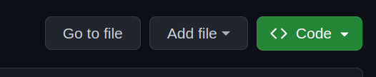
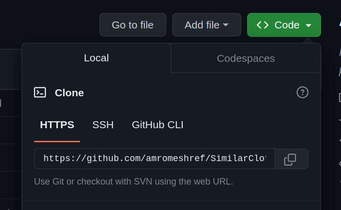

# StyleSync

#### Description:
- The aim of this project is to create an application with the primary objective of proficiently detecting visually similar clothing items.
- The application will be intricately linked to a comprehensive database housing a diverse collection of clothing from various stores.
- Users will be able to upload images of specific clothing item. In response, the application will provide a detailed list of similar clothes, inclusive of images, corresponding prices, and the names of stores where these similar items can be found.
- Demo: https://www.youtube.com/watch?v=xPAKNA1q03M&ab_channel=AhmedGad
  
---

### Table of Contents
1. [How we did it?](#How-we-did-it?)
2. [Classification Model](#Classification-Model)
3. [Similarity Detection Model](#Similarity-Detection-Model)
4. [How to Install?](#how-to-install)

---

## How we did it?
Our project mainly consists of two things:
1. Classification Model which classifies the different types of clothes. We have specifically narrowed our focus to four primary classes: jeans, jackets, shoes, and shirts. Leveraging the efficiency of YOLO (You Only Look Once), this model adeptly categorizes input images into one of these classes.
2. Similarity Detection Model which identifies clothing items with visual similarities to a specific input. We used the Siamese network, a specialized architecture designed for similarity learning. By utilizing this network, we enable the system to discern analogous clothing items based on visual features.
- The workflow seamlessly integrates both models to deliver a comprehensive solution. Once the Classification Model determines the clothing type of an input image, the system seamlessly transitions to the Similarity Detection Model. This latter model then conducts a search within the corresponding directory of that clothing type in the database, identifying and presenting visually similar items, inclusive of images, corresponding prices, and the names of stores where these similar items can be found.

---
  
## Classification Model
- In the development of our Classification Model, we employed the YOLOv8 (You Only Look Once version 8) model, renowned for its efficiency in object detection tasks. The primary objective was to classify images into four distinct classes: jeans, jackets, shoes, and shirts. YOLOv8, with its real-time processing capabilities, allowed us to achieve this classification seamlessly.

- YOLOv8 Model:
YOLOv8 is a state-of-the-art object detection model that excels in real-time applications. Its ability to process images in a single forward pass, detecting and classifying objects with high accuracy, made it an ideal choice for our clothing classification task.

- Training Process:
We utilized a diverse dataset obtained from Roboflow, a platform that automates the annotation and labeling of images. This not only accelerated the training process but also ensured accurate and reliable annotations for our clothing items. The dataset from Roboflow included images of jeans, jackets, shoes, and shirts, covering a wide range of variations in styles and appearances.


---

## Similarity Detection Model
- We used the Siamese network, a specialized neural network architecture designed for tasks involving similarity and distance measurement. Siamese networks are particularly useful in scenarios where the focus is on discerning the similarity or dissimilarity between pairs of input samples.
    - Paper Link: https://www.cs.cmu.edu/~rsalakhu/papers/oneshot1.pdf
- For training the network, it is fed pairs of examples, with one being a positive pair (similar image) and the other a negative pair (dissimilar image). During training, the network adjusts its weights through backpropagation to maximize the similarity between similar images and minimize the similarity between dissimilar images.

#### Data collection for training the Siamese network
- To train a Siamese neural network, you need a dataset of pairs of inputs, where each pair is labeled as either similar or dissimilar.
- We used this dataset to collect these pairs: https://github.com/seralexger/clothing-detection-ecommerce-dataset
- Our data that was used in training:

---

## How to Install?
1. Create a directory in your device.
2. Click on "<> Code"
   
<div align="center">

</div> 

3. Copy the url of this repository.
   
<div align="center">

</div> 

4. Go to the directory you created and type this command to clone this repository:
    ```bash
    git clone "url you copied"
    ```
5. Open the "StyleSync" folder.
6.  Type the following command to install the requirements file using pip:
    ```bash
    pip install -r requirements.txt
    ```
6. Download the siamese_model.rar form: 
7.  If you are a user and want to get similar clothes to a specific item, type the following command to run the app:
    ```bash
    python3 user.py
    ```
8.  If you are a store owner and want to upload your products to our database, type the following command to run the app:
    ```bash
    python3 store.py
    ```  

